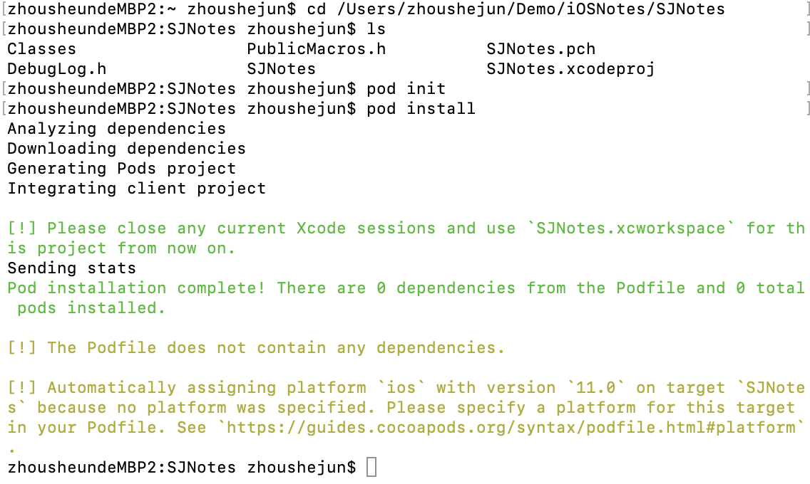
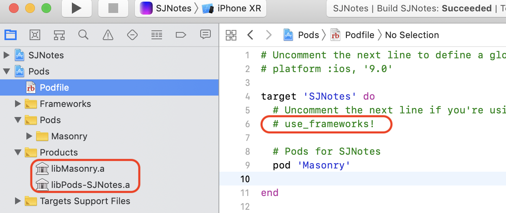
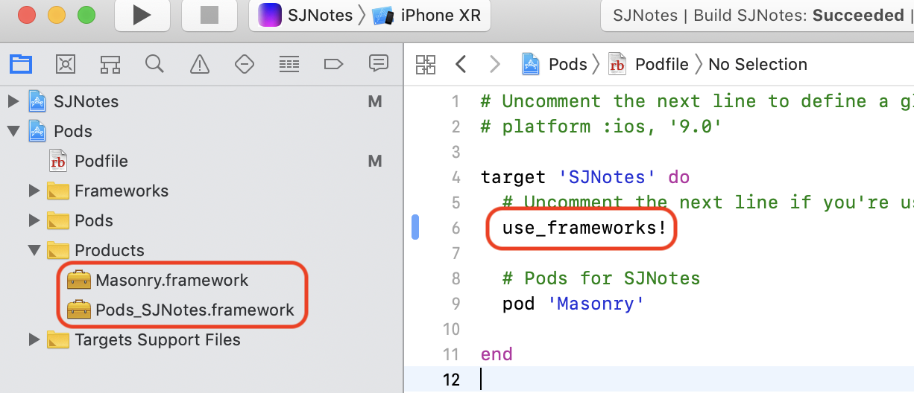
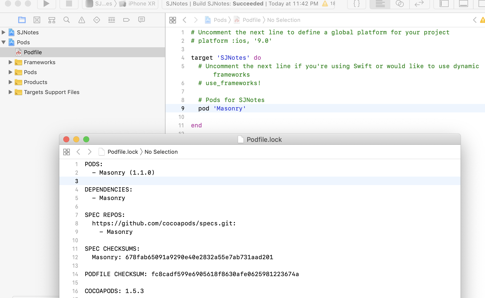
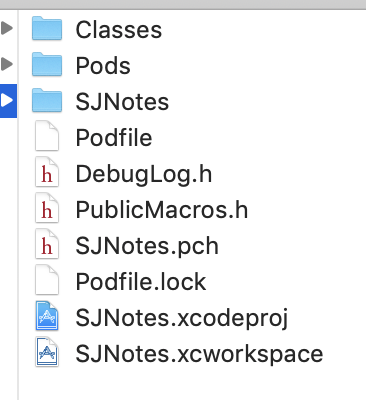

#CocoaPods的使用

##开始使用CocoaPods管理主项目
1.  通过Xcode新建一个项目，取名：`SJNotes`；
2.  终端中，cd到项目目录，即`SJNotes.xcodeproj`所在的目录;
3.  建立`Podfile`配置文件，执行命令：`$ pod init` ；    
4.  编辑`Podfile`配置文件，添加需要的依赖库。可直接通过Xcode打开。
5.  执行导入命令：`$ pod install` 或 `$ pod update`，CocoaPods会自动下载需要的依赖库；下载成功后可以看到工程的根目录下多了2个文件和1个文件夹：`SJNotes.xcworkspace`、`Podfile.lock`文件和`Pods`目录。

打开项目不再是双击`SJNotes.xcodeproj`了，而是双击`SJNotes.xcworkspace`了。

    

## Pods依赖库编译后为：动态库或静态库

`Pods`项目默认会将所有的依赖库分别编译为对应的`.a`静态库。

1. 如果`Podfile`文件中使用了命令`use_frameworks!`，则生成的是`.framework` 的库( 实际内容为: **Header + 动态链接库 + 资源文件**)，使用 `dynamic frameworks` 来取代 `static libraries` 方式。

2. 如果`Podfile`文件中没有使用命令`use_frameworks!`，则生成的是`.a` 的静态链接库，通过 `static libraries` 这个方式来管理pod的代码。

3. Linked:`libPods-xxx.a`包含了其它用`Pod`导入的第三方框架的`.a`文件。

4. Linked:`Pods_xxx.framework`包含了其它用`Pod`导入的第三方框架的`.framework`文件。  
	`use_frameworks!` -> `dynamic frameworks` 方式 -> `.framework`  
	`#use_frameworks!` -> `static libraries` 方式 -> `.a`

    

    

## Podfile.lock文件说明

执行完`pod install` 后会生成一个`Podfile.lock`的文件，该文件用于保存已经安装的`Pods`依赖库及对应的版本，如目前已安装了`Masonry`依赖库后的`Podfile.lock`文件内容为：
    

`Podfile.lock`文件最大的用处在于多人开发。对于没有在Podfile中指定Pods依赖库版本的写法如图中的：  

> `pod 'Masonry'`

该句话用于获取当前`Masonry`依赖库的最新版本。

当团队中的某个人执行完`pod install`命令后，生成的`Podfile.lock`文件就记录下了当时最新`Pods`依赖库的版本，这时团队中的其它人`check`下来这份包含`Podfile.lock`文件的工程以后，再去执行`pod install`命令时，获取下来的`Pods`依赖库的版本就和最开始用户获取到的版本一致。如果没有`Podfile.lock`文件，后续所有用户执行`pod install`命令都会获取最新版本的`Masonry`，这就有可能造成同一个团队使用的依赖库版本不一致，这对团队协作来说绝对是个灾难！
在这种情况下，如果团队想使用当前最新版本的`Masonry`依赖库，有两种方案：

1. 更改`Podfile`，使其指向最新版本的`Masonry`依赖库；
2. 执行`pod update`命令；

>鉴于`Podfile.lock`文件对团队协作如此重要，我们需要将它添加到版本管理中。参见官网：https://guides.cocoapods.org/using/pod-install-vs-update.html 。

## Podfile配置文件

对于使用`CocoaPods`来管理工程的团队来说，跟每个开发人员打交道最多的就是`Podfile`文件。`CocoaPods`是用`Ruby`实现的，因此`Podfile`文件的语法就是`Ruby`的语法。接着从以下几个方面来介绍`Podfile`：

1. `Podfile`文件存放位置：推荐存放在工程根目录下。当然，原则上该文件可以存放在任意一个目录下，需要做的是在该文件中指定工程的路径。即在`Podfile`文件第1行增加如下代码：   
> `xcodeproj "/Users/UserName/iOSNotes/iOSNotes.xcodeproj"`  
>
>指定路径使用的是`xcodeproj`关键字。
此后，进入`Podfile`文件所在路径，执行`pod install`命令就会和之前一样下载这些`Pods`依赖库，而且生成的相关文件都放在了`Podfile`所在目录下面。`iOSNotes`使用的是存放在工程根目录下，所以看到的就是如下图所示：      

2. `Podfile` 和 `target`：`Podfile`是一个描述一个或多个`Xcode`项目的`target`的依赖关系的规范。该文件只能命名为`Podfile`。
旧版本的`CocoaPods`，如果我们不显式指定`Podfile`对应的`target`，`CocoaPods`默认会创建一个名称为`default`的`target`，会和我们工程中的第1个`target`相对应。换句话说，如果在`Podfile`中没有指定`target`，那么只有工程里的第1个`target`能够使用`Podfile`中描述的`Pods`依赖库。
新版本的`CocoaPods`默认会创建工程中所有的同名的`target`。
如果想在一个`Podfile`中同时描述`project`中的多个`target`，根据需求的不同，可以有不同的实现方式。参见：[CocoaPods的常用命令](CocoaPods的常用命令.md)

3. 使用`Podfile`管理`Pods`依赖库版本：引入依赖库时可以显示或隐式注明引用的依赖库版本，具体写法和表示如下：
> `pod 'SSZipArchive'`：使用最新版本的Pod
>
> `pod 'Objection', '0.9'`：指定该版本号
> 
> 除了没有版本或特定版本，还可以使用逻辑运算符：
> 
> `'> 0.1'` 任何高于0.1的版本
>
> `'>= 0.1'` 版本0.1和任何更高版本
>
> `'< 0.1'` 任何低于0.1的版本
>
>` '<= 0.1'` 版本0.1和任何较低版本
>
> 除了逻辑运算符，`CocoaPods`还有一个乐观的运算符`~>`：
>
>` '~> 0.1.2'` 版本0.1.2和版本高达0.2，不包括0.2和更高
>
>` '~> 0.1' `版本0.1和版本高达1.0，不包括1.0和更高版本
>
>` '~> 0'` 版本0及更高版本，这与没有版本基本相同。
>
> 有关版本控制策略的更多信息:https://semver.org/

`Podfile`的更多信息，请参见官网：https://guides.cocoapods.org/using/the-podfile.html 。

## Swift与OC混合编辑

1. 用`CocoaPods` 导入`OC`框架到`OC`项目    
（1）`#use_frameworks!` ：在需要用到的文件里 `#import <xxx/xxx.h>`，如：`#import <SDWebImage/UIImageView+WebCache.h>`；也可以通过`pch`文件，用法类似`OC`中的头文件。  
（2）`use_frameworks! `：与(1)类似，用法上没有区别。
2. 用 `CocoaPods` 导入`OC`框架到 `Swift`项目  
（1）`#use_frameworks!`：必须创建头文件，在头文件里面 `#import "xxx.h"`  
（2）`use_frameworks!` ：如果有头文件，在头文件里面 `#import "xxx/xxx.h"`，其它`Swift`文件中用到不需要再`import`；如果没有头文件，则在每个需要用到的`Swift`文件里 `import xxx`，如`import AFNetworking`。

3. 用 `CocoaPods` 导入 `Swift`框架到 `Swift`项目  
（1）必须`use_frameworks!`  
（2）不需要头文件，在需要用到框架的swift文件里 `import xxx`，如：`import Masonry`

> 注意： 
> 
>1.  用 `CocoaPods` 导入 `Swift` 框架到 `Swift`项目 或 `OC`项目 都必须要 `use_frameworks!`。  
	`swift`项目：`CocoaPods` 默认 `use_frameworks! `；  
	`OC`项目：`CocoaPods` 默认 `#use_frameworks!`。
>
>2. 静态库:（.a）在编译时会将库copy一份到目标程序中，编译完成之后目标程序不依赖外部的库也可以运行。但缺点是会使应用程序变大。
>
>3. 动态库：（.dylib）编译时只存储了指向动态库的引用。可以多个程序指向这个库，在运行时才加载，不会使应用体积变大。但缺点是运行时加载会损耗部分性能，并且依赖外部的环境，如果库不存在或者版本不正确则无法运行。
>
>4. framework：实际上是一种打包方式，将库的二进制文件、头文件和有关的资源文件打包到一起，方便管理和分发。

--------------------------------------------

上一篇：[CocoaPods的常用命令](CocoaPods的常用命令.md)

下一篇：[本地私有库的使用](本地私有库的使用.md)