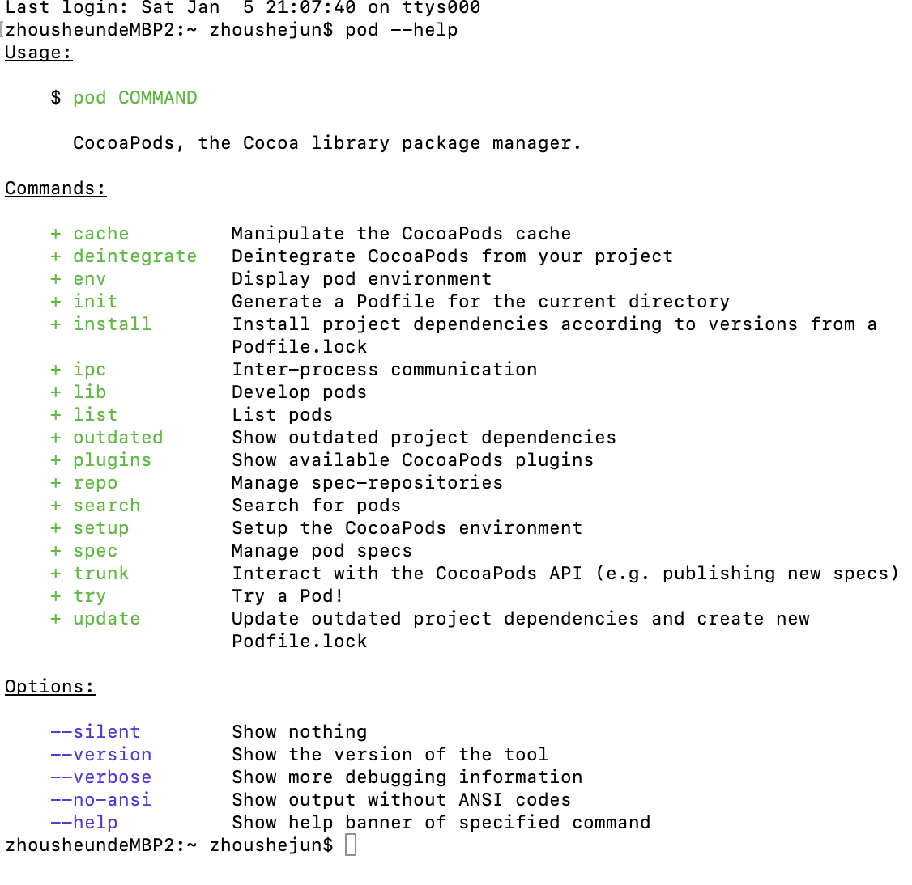
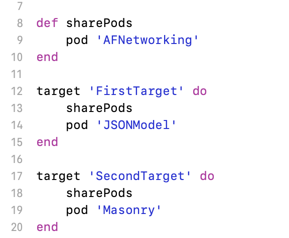

#CocoaPods的常用命令

通过终端可以下载pod常用命令：

`pod --version`:查看当前版本号。

`pod setup`:设置**CocoaPods**环境。需要从网络上下载安装，比较耗时。

`pod init`:创建**Podfile**文件，在该文件中写入需要的第三方依赖库，再执行`pod install`或`pod update`即可点击**.xcworkspace**文件启动项目并通过CocoaPods管理主项目了。

`pod install`:根据**Podfile**文件指定的内容安装依赖库，如果有**Podfile.lock**文件而且对应的**Podfile**文件未被修改，则会根据**Podfile.lock**文件指定的版本安装。每次更新了**Podfile**文件时都需要重新执行该命令以便重新安装**Pods**依赖库。不会更新已经安装的库，需要安装新的或者移除已存在的**pod**的时候使用。**Podfile.lock** 文件记录着上一次下载的依赖库及对应的版本。

`pod install --verbose --no-repo-update`:作用与**pod install**一样，但是不会获取更新的**pod specs**。

`pod update`:在没有指定**pod**依赖库的版本的情况下，无论本地有没有**Podfile.lock**文件都会去拉取最新版本的依赖库。

`pod update --verbose --no-repo-update`:作用与pod update一样，但是不会获取更新的pod specs。

`pod spec create  a `:创建依赖描述文件**a.podspec**文件。用于管理本地私有库。

`pod spec lint  a.podspec`:检查依赖描述文件。

`pod 'a', '0.0.1'`:使用依赖文件。

`platform :ios, '9.0'`:指定平台版本。

1. 多个target中使用相同的Pods依赖库：将相同的依赖库通过**def**的方式定义，之后在使用第2点的方式在**do**与**end**间引用即可。

2. 不同的target使用完全不同的Pods依赖库：分别使用 **target 'target-name' do .... end** 的方式声明。    

--------------------------------------------

上一篇：[安装CocoaPods](安装CocoaPods.md)

下一篇：[CocoaPods的使用](CocoaPods的使用.md)