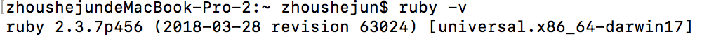
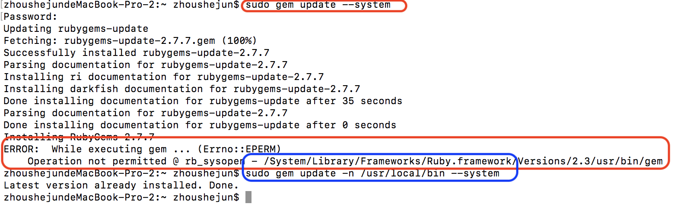
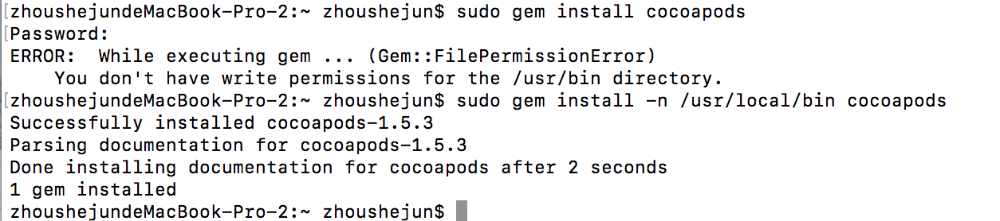

#安装CocoaPods

Mac自带Ruby，无需全新安装，但可能需要升级。
		

##1.升级Ruby

在确定升级前，请先查看当前版本:

升级时，如果报错，使用蓝色的命令行:

##2.安装Cocoapods
安装命令：`sudo gem install cocoapods`  
如果报错，使用命令安装：`sudo gem install -n /usr/local/bin cocoapods`

----------------------------------
>安装成功后，如果 `pod install` 或 `pod update` 时报错：    
>Unable to add a source with url `https://github.com/CocoaPods/Specs.git`……  
>解决办法是:  
>1.  进入/users/用户名/.cocoapods/repos，删除master文件夹  
>2. 重新下载CocoaPods仓库:    
	`git clone https://git.coding.net/CocoaPods/Specs.git ~/.cocoapods/repos/master`

--------------------------------------------

上一篇：[关于CocoaPods](关于CocoaPods.md)

下一篇：[CocoaPods的常用命令](CocoaPods的常用命令.md)