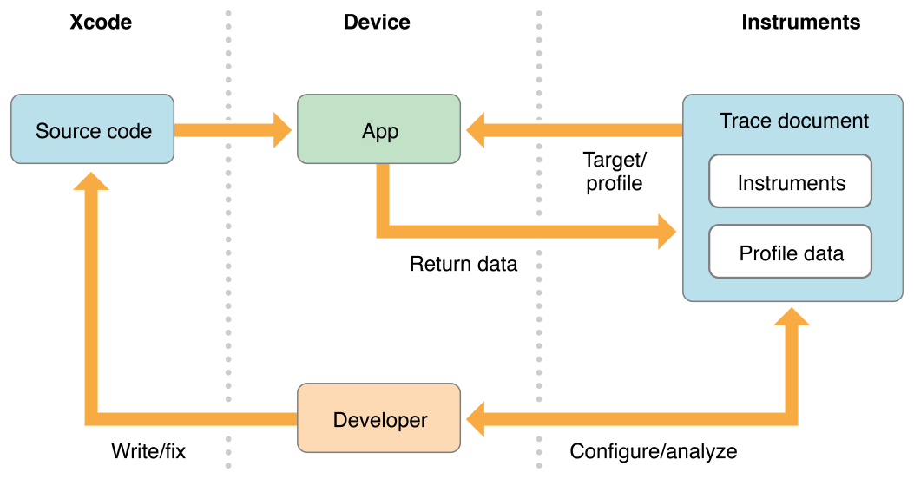
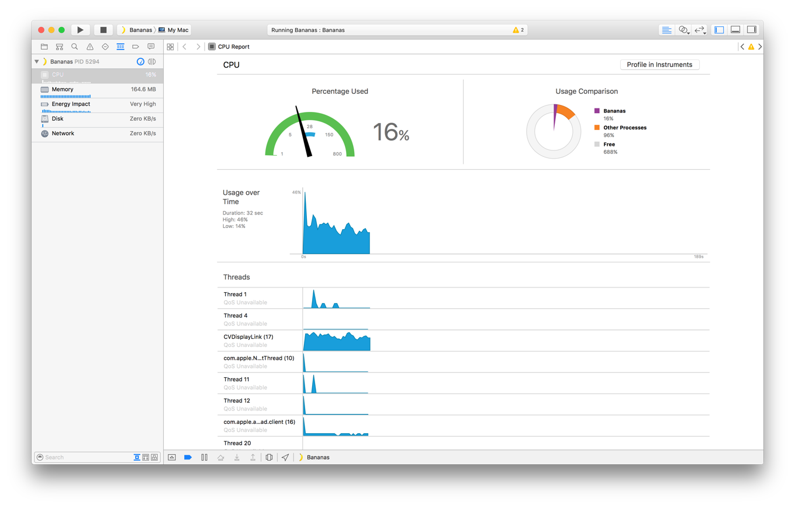

#Instruments工作流程

----------------------------------------------

Instruments看起来像一个复杂的应用程序。这是因为它可以用来收集各种有关您的应用程序的有用信息，并帮助您诊断和解决问题。但是，整个Instruments工作流程相对简单（见图2-1）。

图2-1仪器工作流程

从整体上说，它由以下几个主要阶段组成：

1. 创建包含所需工具和配置的跟踪文档。
2. 将设备和应用关联到配置文件。
3. 对APP进行性能分析。
4. 分析在性能分析期间捕获的数据。
5. 修复源代码中的问题。

##知道何时使用Instruments

在使用Instruments之前，请使用Xcode的调试导航器仪表（图2-2）测试您的应用程序。这些仪表提供有关您的应用程序的CPU，内存，电量使用情况等的高级信息。他们通常会提供您需要的提高性能并快速解决常见问题的所有信息。当您需要执行更详细的分析时使用Instruments。

图2-2 Xcode中的CPU调试表

##

--------------------------------------------

上一篇：[关于Instruments](关于Instruments.md)

下一篇：[关于本文档](关于本文档.md)