#创建、保存和打开跟踪文档
--------------------------------------------

在乐器中，所有的工作都是在一个跟踪文档中完成的，这个文档包含了一套工具，它们的配置设置以及他们收集的数据。使用跟踪文档对应用进行概要分析后，可以保存文档以保留您收集的跟踪数据，稍后再打开以查看和分析。

##关于分析模板

当仪器首次启动时，它提供了一个分析模板列表（见图6-1）。每个模板都包含一组仪器，这些仪器通常用于分析应用程序并收集有用的信息，以帮助识别问题或使您的应用程序更高效。

图6-1概要分析模板选择对话框：

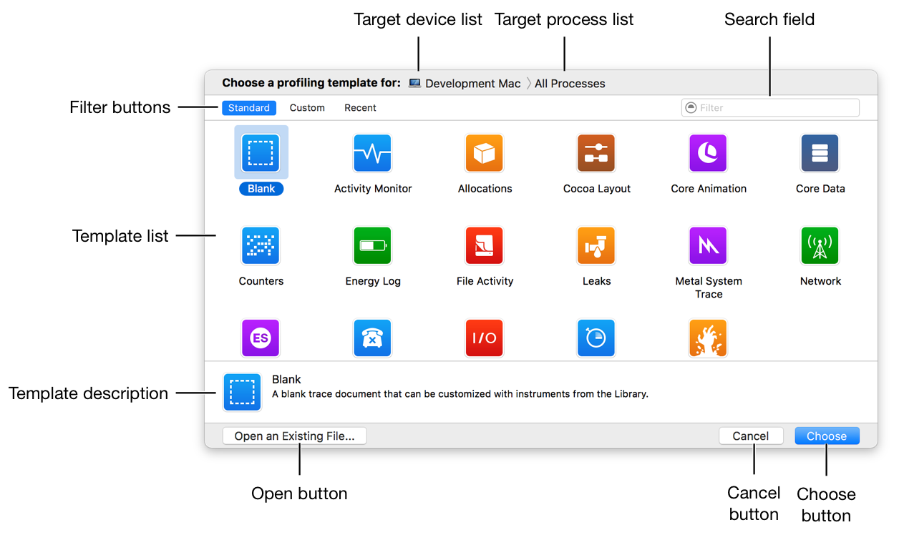

无论何时需要为特定目的收集数据，您都应该计划使用分析模板作为起点。例如，如果你想检查你的应用程序的内存问题，你应该选择一个内存相关的模板，比如Allocations，Leaks或者Zombies。使用模板创建跟踪文档后，可以随时添加或移除单个乐器，或根据需要重新配置乐器。

有关可用模板及其包含的工具的完整列表，请参阅分析模板。

##创建一个跟踪文档

您需要创建一个跟踪文档来开始使用仪器进行分析。

###创建一个跟踪文档

1. 启动仪器。
2. 在出现的性能分析模板选择对话框中，选择一个目标设备和进程。
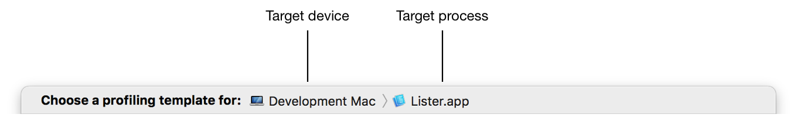

3. 选择所需的性能分析模板。
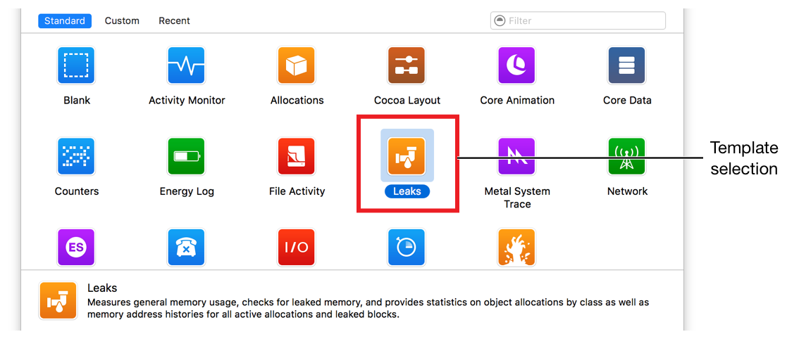

4. 点击选择。

使用您选择的模板中的预配置仪器创建一个新文档。

>提示
>
>要在创建跟踪文档之后立即自动开始分析您的应用程序，请在分析模板选择对话框中按住Option键。当你这样做时，选择按钮变成配置文件。单击配置文件以创建文档并立即启动分析。
>如果您无法找到满足需求的模板，或者只想从头开始创建自己的模板，请在“分析模板选择”对话框中选择“空白”模板。

##保存跟踪文档

创建跟踪文档后，可以保存以供日后参考。仪器将跟踪文件保存为仪器跟踪文件的.trace扩展名。

###保存跟踪文档
1. 创建一个跟踪文档。请参阅创建跟踪文档。
2. 选择文件>保存。或者，如果要将以前保存的跟踪文档另存为新文件，请选择“文件”>“另存为”。

 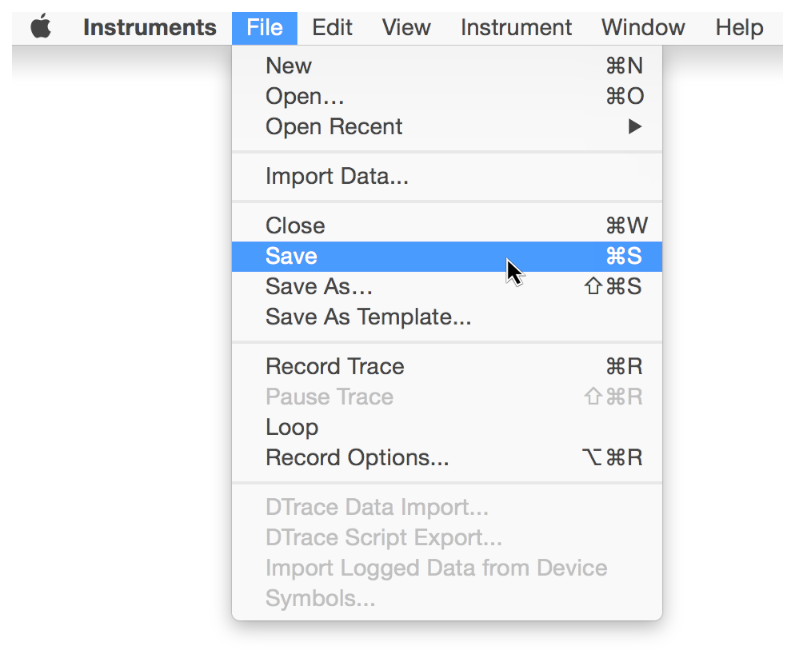
3. 输入文件的名称。

 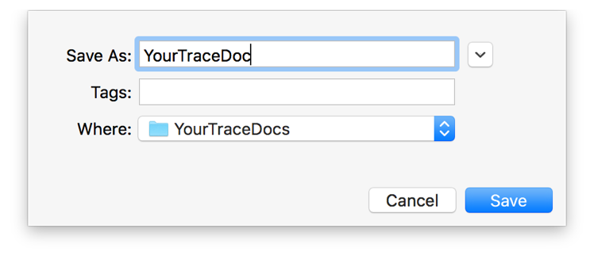

4. 为文件选择一个目的地。
5. 点击保存。

##将跟踪文档保存为分析模板

如果您创建一个跟踪文档，您认为您可能需要再次分析其他应用程序，您可以将其保存为自定义模板，所以您不必每次运行仪器时重新创建它。

###将跟踪文档保存为分析模板
1. 创建或打开一个跟踪文档。请参阅创建跟踪文档。
2. 选择文件>另存为模板。
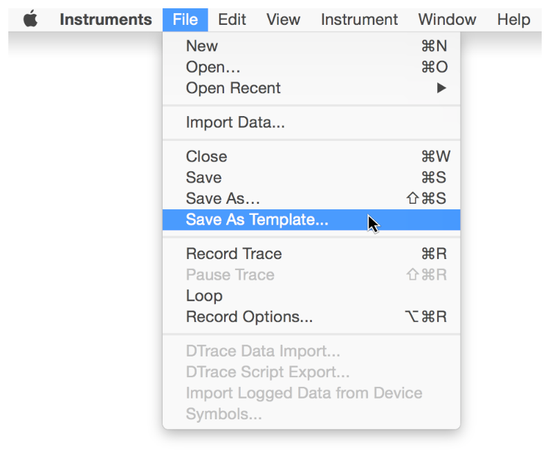
3. 输入模板的名称。
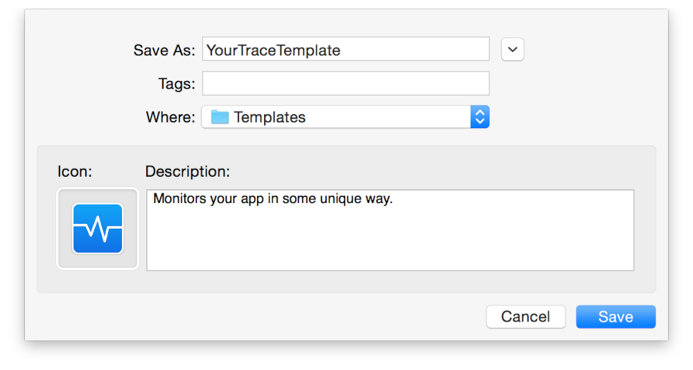
4. 选择模板的目的地。

	将您的模板保存在/Users/<用户名>/Library/Application Support/Instruments/Templates目录中，使其在“工具”窗口的自定义部分中可用。这是另存为模板对话框中的默认目录。
5. 选择模板的图标。
6. 输入模板的描述。
7. 点击保存。

 保存模板后，它将自动出现在分析模板选择对话框中，并与自定义模板分组。下次创建跟踪文档时，可以选择它作为起点。
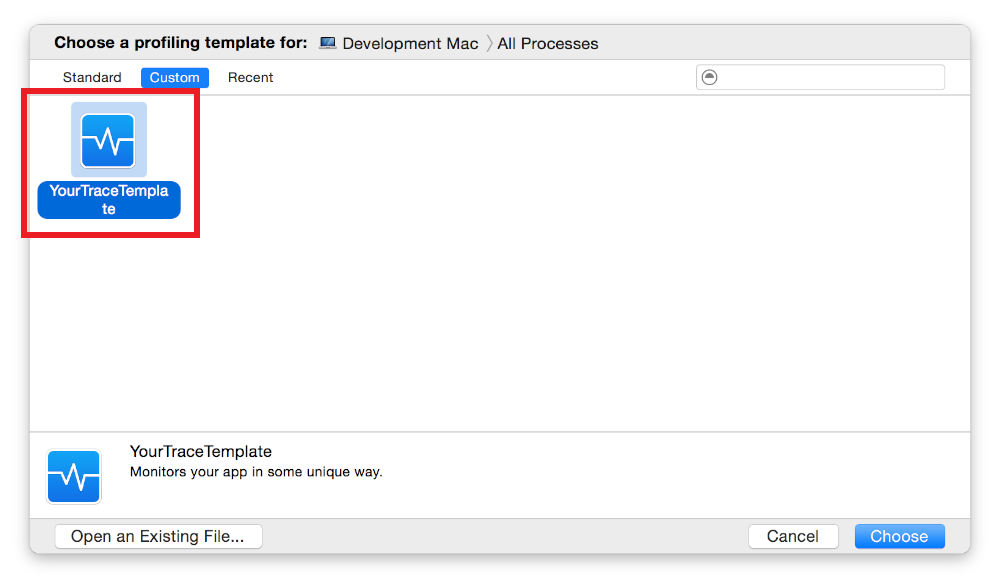

##关闭跟踪文档

###关闭打开的跟踪文档
1. 选择“文件”>“关闭”（或按下Command-W）。
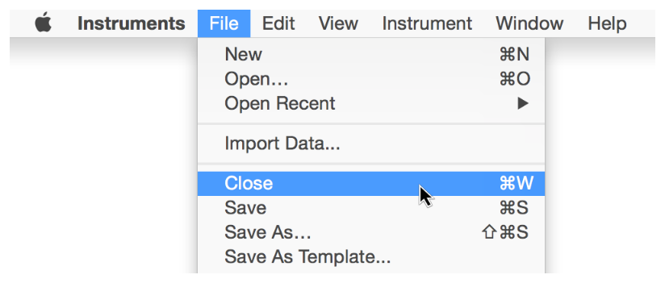
2. 如果您的文档包含未保存的数据，请选择是否保存更新的文档。
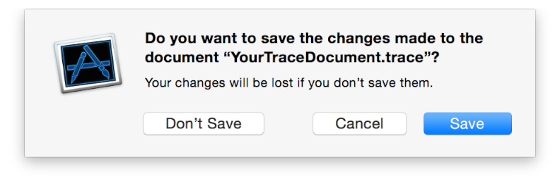
文件关闭。

##打开一个跟踪文档

###打开保存的跟踪文档
执行以下操作之一：
* 双击.traceFinder中的文档文件。
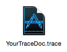
* 将.trace文档文件拖到仪器应用程序图标上。
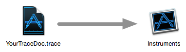
* 打开仪器并执行以下步骤：
 *  选择“文件”>“打开”（或按Command-O）。
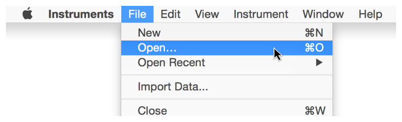
 *  找到一个保存的.trace文档文件。
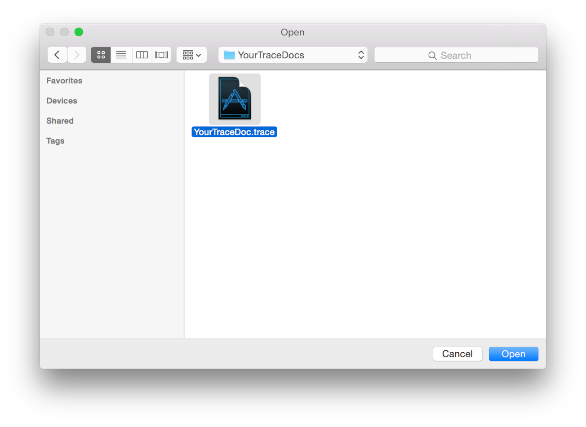
 * 点击打开。
跟踪文档在Instruments中打开。

--------------------------------------------

上一篇：[选择Instruments模块](选择Instruments模块.md)

下一篇：[选择目标设备和进程](选择目标设备和进程.md)