#启动Instruments

--------------------------------------------

Instruments应用程序存在于Xcode应用程序中，所以最直接的方式是从Xcode中启动它。您也可以通过Dock，Launchpad或命令行间接启动它。

##从Xcode启动Instruments

启动Instruments最直接的方法是通过Xcode中的Xcode菜单。

###从Xcode菜单启动Instruments

1.打开Xcode。

2.选择Xcode > Open Developer Tool > Instruments。

>提示  
>您可以使用这种方法来启动一些其他有用的开发工具。

您也可以启动Instruments来分析您在Xcode中正在使用的应用程序。

###分析Xcode打开的项目

1. 启动Xcode并打开您的项目。  

2. 执行以下操作之一：     

* 选择Product > Profile。
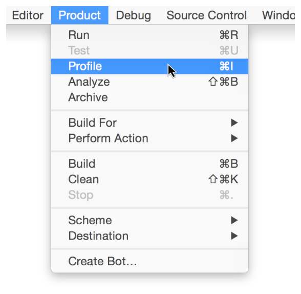

* 点击并按住Xcode工具栏中的运行按钮，然后选择Profile。
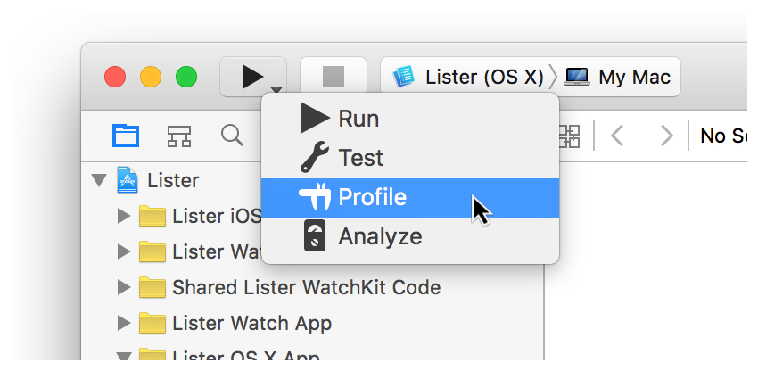

* 按Command+I。

Xcode构建您的项目，Instruments启动，并提示您选择一个分析模板。

如果您需要使用相同的模板来分析您的应用程序，那么您可以将您的Xcode项目设置为在启动分析时自动使用它。

##设置Xcode项目以使用特定的Instruments性能分析模板

1. 启动Xcode并打开您的项目。
2. 选择 Product > Scheme > Edit Scheme:
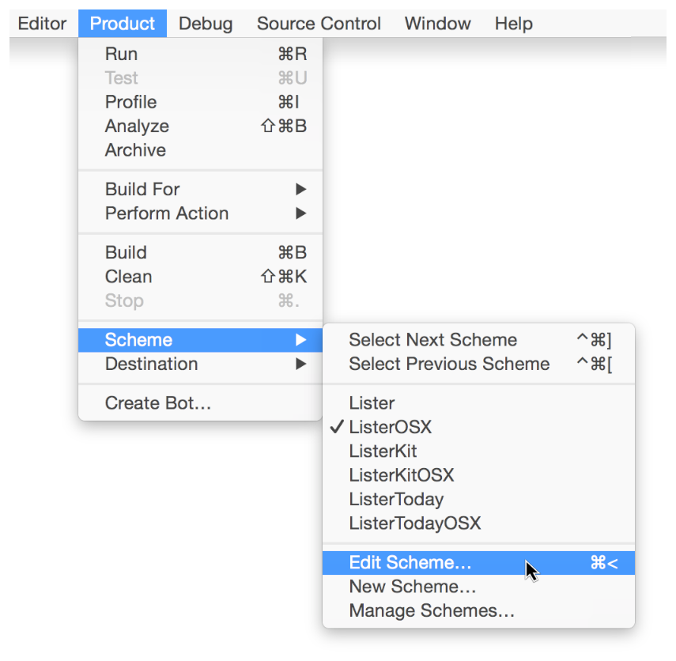

	或者，从Xcode工具栏的Scheme弹出菜单中选择Edit Scheme:
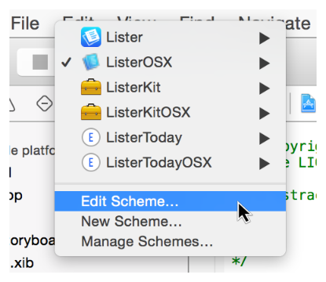

	或者， Command+"<"，出现Scheme editor编辑器对话框：
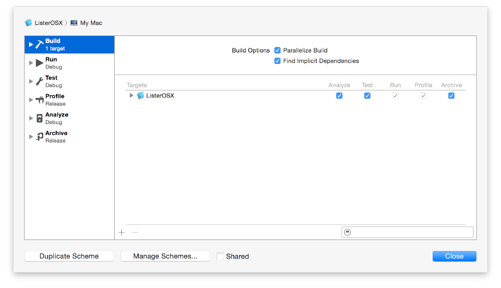

3. 在Scheme editor编辑器对话框的边栏中单击Profile：

4. 在“Info”下，单击Instrument的弹出式菜单，然后选择所需的分析模板：
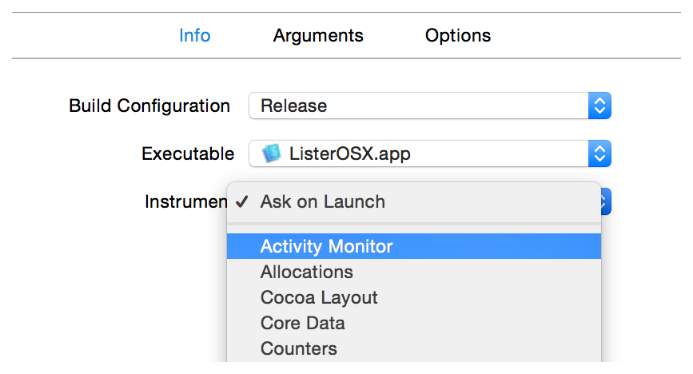

	如果选择“Ask on Launch”，Instruments将在启动时显示其分析模板选择对话框。
5. 点击关闭。
6. 启动分析。请参阅[分析打开的Xcode项目](启动Instruments.md)

Xcode将自动构建您的项目，接着Instruments启动，并开始使用您在Scheme editor编辑器中配置的模板来分析您的应用程序。

##从Dock启动Instruments

Instruments可以从Dock中的Xcode图标启动。

###从Dock中的Xcode图标启动Instruments
1. 打开Xcode。
2. 按住Control键并点按Dock中的Xcode图标，然后从快捷菜单中选择 Options > Open Developer Tool > Instruments：
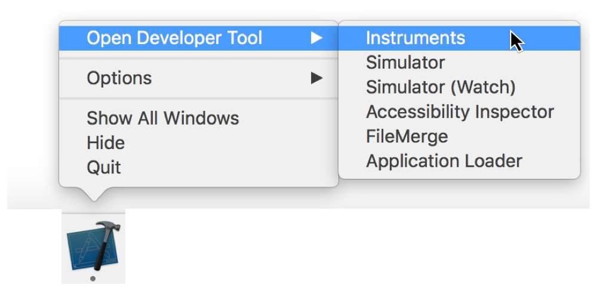

	Instruments应用程序启动。

您也可以将Instruments添加到您的Dock以便快速访问。最快的方法是启动Instruments，然后将其设置为“Keep in Dock”(在 Dock 中保留)。

###将Instruments永久添加到Dock中
1. 打开Xcode。
2. 选择 Xcode > Open Developer Tool > Instruments：

	Instruments启动，其图标出现在您的Dock中。
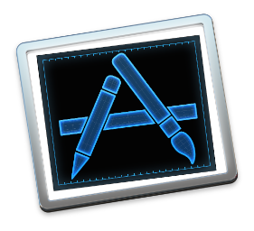

3. 按住Control键并点按Dock中的Instruments图标，然后从快捷菜单中选择"Option" > “Keep in Dock”：

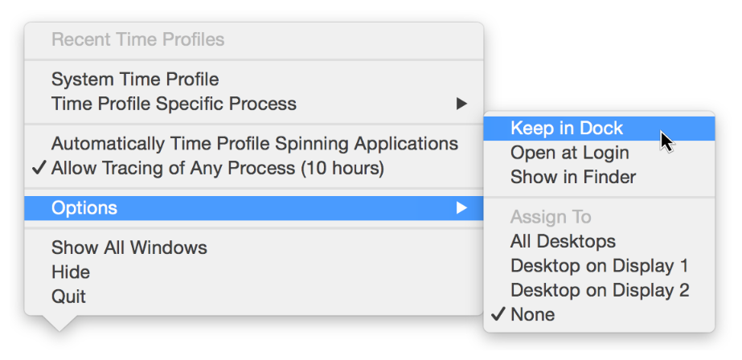

##从Launchpad启动Instruments

Launchpad启动面板会自动显示驻留在“应用程序”文件夹中的应用程序。因为Instruments不在应用程序文件夹中（至少不是直接的 - 它在Xcode中，位于应用程序文件夹中），所以它不会出现在启动面板中。但是，您可以通过创建Instruments的别名并将其放入“应用程序”文件夹来添加它。

###将Instruments添加到Launchpad
1. 打开Xcode。
2. 选择Xcode > Open Developer Tool > Instruments：

	Instruments启动，其图标出现在您的Dock中。

3. 按住Control键点按Dock中的Instruments图标，然后从快捷菜单中选择Options > Show in Finder:
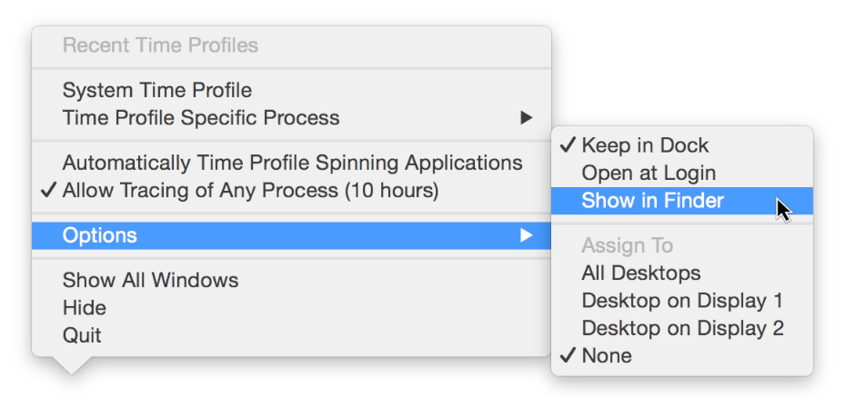

4. Option+Command+拖拽，将Finder中的Instruments应用程序图标拖到您的Applications文件夹中。  
	Instruments的别名已创建并添加到您的应用程序文件夹。
5. 从Instruments别名的文件名中除去别名后缀。  
	Instruments现在出现在Launchpad中：
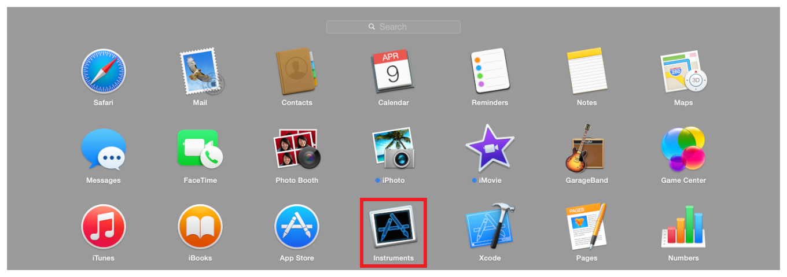

##从命令行启动Instruments

在OS X中您可以使用open命令通过终端启动任何应用程序。

###使用open命令行工具启动Instruments
1. 启动终端（在/Applications/Utilities/）。
2. 运行以下命令：

		open /Applications/Xcode.app/Contents/Applications/Instruments.app
	Instruments应用程序启动。
	

>注意
>
您也可以使用两个命令行实用程序中的任意一个来配置应用程序，而不实际显示Instruments用户界面。
>
* instruments - 此实用程序使用指定的模板来配置应用程序。其结果可以保存到一个文件，然后可以在Instruments应用程序中手动打开，以便查看和分析。有关使用信息，请参见使用Instruments和Instruments的配置文件（1）Mac OS X开发人员工具手册页码。
>
* iprofiler - 此工具使用Activity Monitor、Allocations、Counters、Event Profiler、Leaks、System Trace和/或 Time Profiler来监视应用程序。结果保存到一个“.dtps”文件中，以后可以在Instruments中打开以供查看和分析。有关使用信息，请参阅使用iprofiler和iprofiler 收集和查看数据（1）Mac OS X开发人员工具手册页。

--------------------------------------------

上一篇：[关于本文档](关于本文档.md)

下一篇：[选择Instruments模块](选择Instruments模块.md)