#选择Instruments模块
--------------------------------------------

Instruments有几个关键的窗口和对话框。

##性能分析模板选择对话框

Instruments启动时，将显示一系列分析模板供您选择，包含Instruments预配置文件。此列表包含一组标准模板以及您可能创建的任何自定义模板。（见图5-1）

图5-1性能分析模板选择对话框：

该性能分析模板选择对话框包含以下主要模块：

* 目标设备列表(**Target device list**)：单击此项可选择要在其上进行配置的设备。
* 目标进程列表(**Target process list**)：点击此项可选择要进行配置的进程或进程。
* 过滤器按钮(**Filter buttons**)：单击此处可以过滤模板列表，只显示标准模板，自定义模板或最近使用的模板。
* 搜索栏(**Search field**)：输入一些文字快速找到您需要的模板。可以搜索模板的标题和描述说明。
* 模板列表(**Template list**)：性能分析模板列表，如果您单击过滤器按钮或输入搜索条件，则可能是过滤后的模板。
* 模板描述(**Template description**)：当前选择的性能分析模板的简短描述，可以帮助您确定所选模板是否符合您的需求。
* 选择按钮(**Choose button**)：点击此按钮，根据当前选择的模板创建一个新的性能分析配置文件。  
	当您按下*Option*键时，此按钮标题将变为“Profile”。单击“Profile”按钮，根据当前选定的模板创建新文档，并立即开始分析目标进程。
* 打开按钮(**Open button**)：点击此按钮打开一个先前保存的Profile文件，而不是从一个新的模板开始。
* 取消按钮(**Cancel button**)：点击此按钮关闭模板选择对话框。

>提示
>
>您可以随时通过选择File> New（或按Command+N）来显示性能分析模板选择对话框。

##跟踪文档或轨迹记录文档(Trace Document)

跟踪文档（图5-2）用于组织和配置Instruments，以便进行性能分析、收集数据以及查看和分析结果。您可以通过启动Instruments并选择分析模板或通过从Xcode，Dock或命令行启动分析来创建新的跟踪文档。您也可以保存并重新打开已配置Instruments和已收集数据的跟踪文档。跟踪文档可以包含很多非常详细的信息，这些信息通过一些图表和区域呈现给您。

图5-2跟踪文档

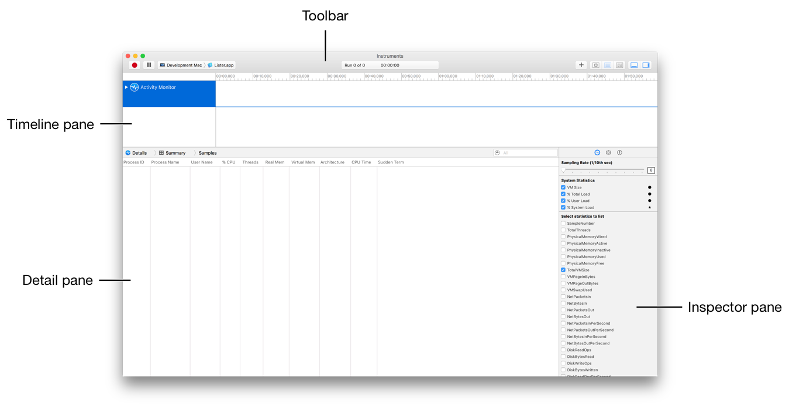

###工具栏(Toolbar)

工具栏（图5-3）允许您启动、暂停和停止数据分析、添加Instruments、隐藏和显示模板等等。

图5-3跟踪文档工具栏

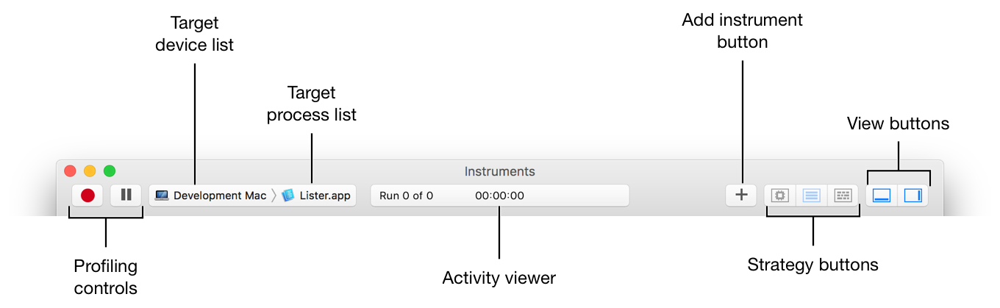

它包括以下主要内容：

* 分析控件(**Profiling controls:**)：允许您记录，暂停和停止数据收集。
* 目标设备列表(**Target device list**)：允许您选择您想要进行配置的设备。
* 目标进程列表(**Target process list**)：允许您选择要进行配置的进程或进程。
* 活动查看器(**Activity viewer**)：显示当前轨迹的经过时间或时间线视图中检查头的位置。如果跟踪文档有多个与之关联的数据运行，那么这里也会显示。

* 添加Instrument按钮(**Add Instrument button**)（+）：显示或隐藏Instruments库调色板，其中包含可用Instruments的完整列表。从这里，您可以选择单个Instruments并将其添加到跟踪文档中。
* 策略按钮(**Strategy buttons**)：控制时间线视图中显示的信息的类型。

 * CPU（）：在时间轴视图中显示CPU内核列表及其收集的数据。只有跟踪文档包含记录CPU数据的Instruments时才可用。

 * Instruments（）：在时间轴视图中显示Instruments及其对应数据的列表。

 * 线程(**Threads**)（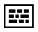）：在时间线视图中显示线程列表及其对应的数据。只有跟踪文档包含记录线程数据的工具时才可用。

* 视图按钮(**View buttons**)（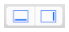）：隐藏或显示详细视图和检查器视图。

###时间轴面板(Timeline Pane)

时间轴面板显示为给定轨迹(trace)记录的数据的图形概要信息。在该面板中，每个Instruments、CPU核心或线程都有自己的“轨道(trace)”，它提供了收集数据的图形图表。单击工具栏中的策略按钮(Strategy buttons)以显示Instruments、CPU核心或线程数据。

尽管此面板的信息是只读的，但您可以滚动浏览数据，选择特定区域进行仔细检查，并插入标记以突出显示兴趣点。您可以通过调整缩放级别或更改检查器中各个Instruments的记录设置来更改图形信息的显示方式。

###Instruments策略视图(Instruments strategy view)

这是跟踪文档(trace document)中包含的所有单个工具的列表及其收集的数据（请参见图5-4）。您可以从库调色板中将新Instruments拖放到列表中（请参阅将Instruments添加到跟踪文档(trace document)）。如果您在列表中选择一种Instruments，则可以在检查器视图中将其删除或配置。创建跟踪文档时，默认情况下可以显示文档列表。

图5-4跟踪文档时间轴视图中的Instruments活动：

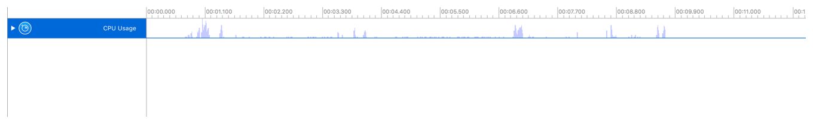

###CPU策略视图(CPU strategy view)

如果跟踪文档(trace document)包含Instruments记录的CPU相关数据，则会显示一系列CPU内核及其使用情况（图5-5）。

图片5-5 “跟踪文档时间轴”视图中的CPU活动：

###线程策略视图(Threads strategy view)

如果跟踪文档(trace document)包含instruments记录的线程相关数据，则会显示线程列表及其使用情况（图5-6）。

图片5-6跟踪文档时间线视图中的线索活动：

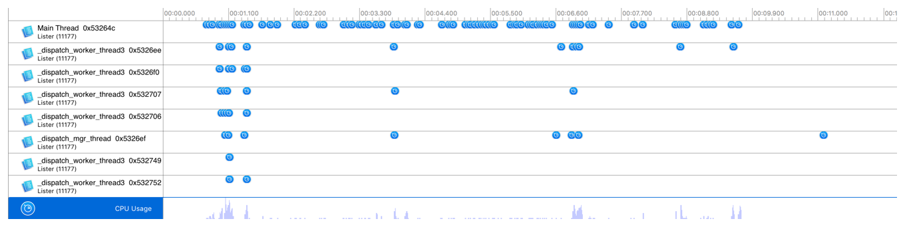

###细节视图(Detail Pane)

此视图显示跟踪文档(trace document)中Instruments收集的数据的详细信息（请参见图5-7）。在时间线视图中选择一个单独的Instrument，以查看在分析时收集的数据。

图片5-7跟踪文档详细信息视图：

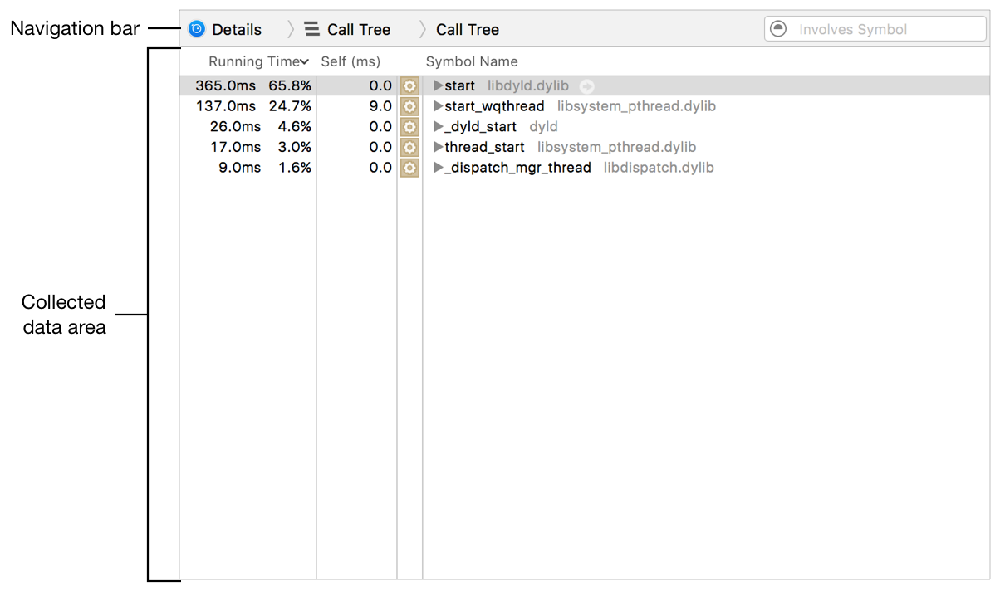

###导航栏(Navigation bar)

详细信息视图顶部的导航栏（图5-8）可帮助您浏览收集的数据。您可以使用它在不同类型的数据之间切换，并浏览不同级别的数据。

图5-8跟踪文档详细信息视图中的导航栏：

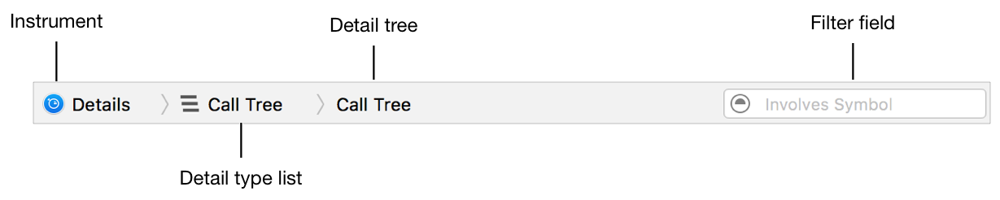

* Instruments：时间轴视图中当前所选Instruments的图标。点击这个查看Instruments的控制台。
* 详细类型列表(Detail type list)：允许您在不同类型的数据之间导航。这里显示的选项会有所不同，具体取决于主动选择的Instruments。对于许多Instruments，该列表包括诸如数据摘要(summary of data)、调用树(call tree)和控制台(console)之类的东西。
* 详细信息树(Detail tree)：在浏览详细信息视图中的数据时，跟踪您在层次结构中的位置。单击树的分支以将层次结构向上返回相应的数据。
* 筛选区域(Filter field)：允许您为特定字词筛选收集的数据。单击过滤器区域的菜单以获取一些其他过滤选项。您还可以通过调整“检查器”视图中的显示设置来更广泛地过滤收集的数据。

###收集数据区(Collected data area)

收集的数据区域（图5-9）通常以表格形式显示所选Instruments的所有数据。这里显示的内容因Instruments而异。例如，活动监视器(Activity Monitor)显示进程、CPU和线程信息等等。

图片5-9跟踪文档详细信息视图中的收集数据区域：

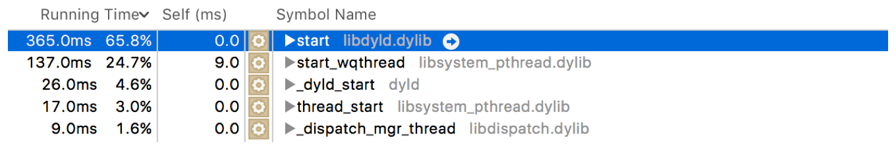

通常情况下，此区域内的各个符号和数据点都包含导航按钮（），当您将鼠标指针移动到其上方时，它就会出现。您可以点击这些按钮来更深入地了解数据。与您一样，导航栏中的详细信息树会进行更新以反映您在层次结构中的位置，如图5-10所示。

图5-10跟踪文档详细信息视图的层次结构导航：

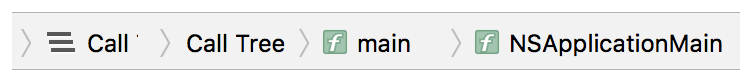

###检查器视图(Inspector Pane)

此视图包含每个Instrument具体的设置（图5-11），您可以调整该设置以控制录制行为以及时间线和详细信息视图中的可见信息。此视图有时还会显示其他信息，这些信息在浏览详细信息视图中的数据时可能会有用。

图片5-11跟踪文档检查器视图的区域：
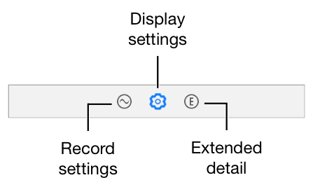

###记录设置区域(Record settings area)

此区域中可用的设置因使用的Instrument而异。通常，Instruments提供的设置允许您调整与记录数据有关的某些属性，例如采样率或捕获的统计类型，如图5-12所示。

图片5-12跟踪文档检查器视图的记录设置区域：
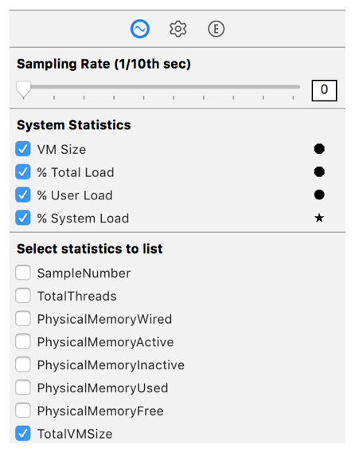

###显示设置区域(Display settings area)

此区域中的设置也因使用的Instrument而异。这些设置可以帮助您：

* 控制在详细信息视图中显示的数据。例如，Instruments可能允许您在浏览调用树(call tree)时隐藏系统库。
* 通过过滤和数据挖掘更有效地浏览记录的数据。
* 调整录制的信息在时间轴视图中的表现方式。例如，Instruments可以允许您更改用于表示其收集的数据的图形样式。

图5-13显示了所选Instruments的显示设置示例。

图5-13 “跟踪文档检查器”视图的显示设置区域：

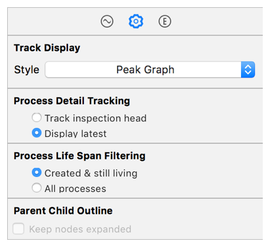

###扩展细节区域(Extended detail area)

该区域不包含任何设置。而是用于在详细信息视图中显示有关所选数据的额外信息，如完整的堆栈跟踪，如图5-14所示。

图片5-14跟踪文档检查器视图的扩展详细信息区域：
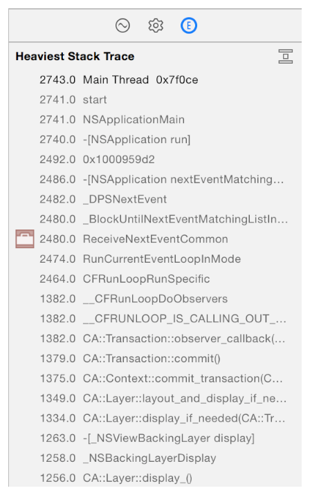

###库面板(Library Palette)

库面板（图5-15）提供了可用Instruments的完整列表，并允许您将它们添加到跟踪文档中。在这里，您可以浏览Instrument描述信息并筛选特定Instrument。要显示库面板，请选择“Window > Library”，或按下“Command+L”或单击“跟踪文档”工具栏中的“添加工具”按钮（+）。

图5-15库面板：

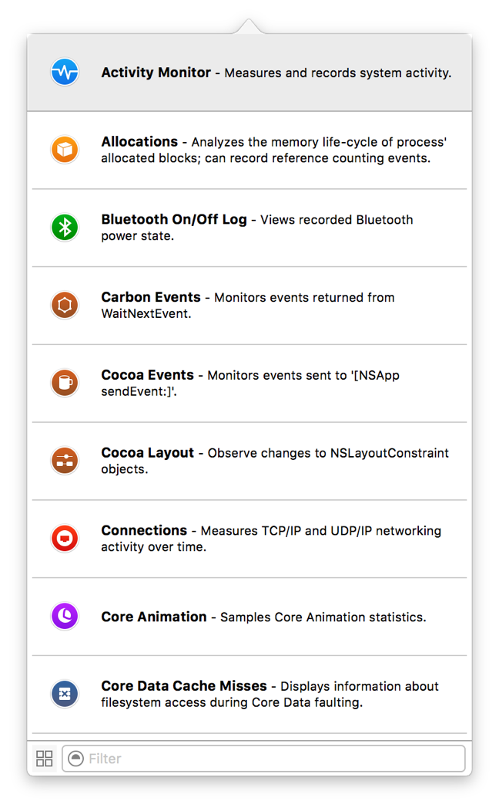

有关更多信息，请参阅以下部分：

* [在库面板中查找工具](访问和使用个性化Instruments.md)
* [添加一个工具到跟踪文件](访问和使用个性化Instruments.md)

###标志面板(Flags Palette)

标志面板（图5-16）显示了您可能在活动跟踪文档的时间轴视图中应用的任何标志的列表。在此标志板中，您可以选择一个标志以在时间轴中快速导航到该标志。您还可以筛选特定标志的大量列表，显示和隐藏标志，并查看有关标志的时间戳信息。

图5-16标志面板

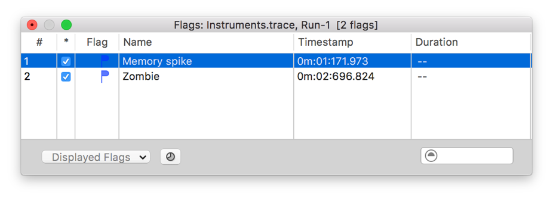

###偏好窗口(Preferences Window)

偏好窗口（图5-17）用于控制与Instruments行为有关的各种设置。在这里，您可以调整与启动、保存等有关的常规设置。您还可以调整录制设置、CPU设置和符号首选项。请参阅首选项以获取可通过此窗口修改的设置和选项的完整列表。

图5-17 General偏好窗口

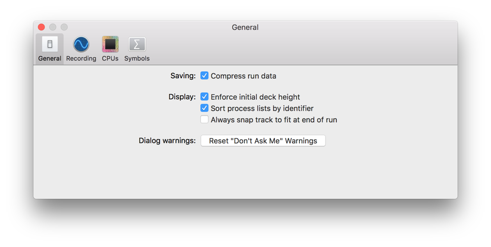

--------------------------------------------

上一篇：[启动Instruments](启动Instruments.md)

下一篇：[创建、保存和打开跟踪文档](创建、保存和打开跟踪文档.md)